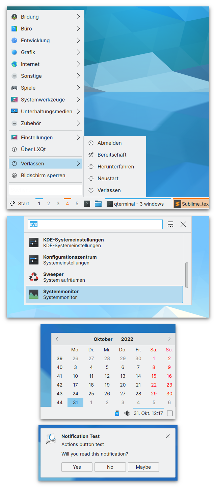

# LXQt Breeze Theme

An LXQt theme inspired by KDE/Plasma and Breeze based on the redesign of Breeze in Plasma 5.24 and later.
Comes in a dark and light variant.
It was originally based on the included "KDE-Plasma" theme of LXQt and has been modified to include a dark theme, apply consistent styling throughout all widgets using a variable-based build process and apply Breeze-inspired styling to many elements not covered by the original theme.

**You can download the theme using the "Download theme" links on the [release page](https://gitlab.com/M4he/lxqt-theme-breeze/-/releases).**

## Preview

| Dark theme | Light theme |
|---|---|
|  |  |

## Usage

> **HINT:** you can download a pre-built release of the theme on the [release page](https://gitlab.com/M4he/lxqt-theme-breeze/-/releases)!

### (Re)Building the theme

```bash
bash build-lxqt-themes.sh
```

The resulting themes will be located in the `themes/` directory of this repository.

### Installing the theme

Simply copy the themes from the `themes/` directory of this repository to `~/.local/share/lxqt/themes/`:

```bash
mkdir -p ~/.local/share/lxqt/themes
cp -r ./themes/* ~/.local/share/lxqt/themes/
```


## Repository

This is the build repository for the Breeze LXQt theme.
It builds the light and dark theme based on color definitions and assets of the `src/` directory.
You can adjust the `.colors` definitions files and rebuild the theme if you want other color schemes.
The included dark and light color schemes are based on KDE/Plasma's and Breeze's dark and light default styles respectively.

### Structure

```
lxqt-theme-breeze/
├── build-lxqt-themes.sh  -- the main build script
├── Dark.colors           -- color definitions of the dark theme
├── Light.colors          -- color definitions of the light theme
├── src/
│   ├── common/           -- source assets used in all themes + QSS files
│   ├── dark/             -- source assets used in dark themes
│   └── light/            -- source assets used in light themes
└── themes/               -- (this folder is created during build)
    ├── Dark Breeze/      -- finished build of the dark theme (after building)
    └── Light Breeze/     -- finished build of the light theme (after building)
```

### Creating a new color scheme

1. choose the theme you want to base on and copy it:
    ```
    cp Dark.colors MyColor.colors
    ```
    (the `#!SCHEME:` at the top of the file determines the asset base)
2. adjust the colors in `MyColor.colors`, especially the accent colors
3. execute the build script
4. you should now find a `Breeze MyColor` directory in `themes/`


## Credits

- included wallpaper "Altai" made by Alesya Khoteeva of the KDE Visual Design Group (VDG), [https://github.com/KDE/plasma-workspace-wallpapers](https://github.com/KDE/plasma-workspace-wallpapers)
- some included icons from the Breeze icon theme made by the KDE Visual Design Group (VDG), [https://github.com/KDE/breeze](https://github.com/KDE/breeze)
- based on the "KDE-Plasma" LXQt theme made by the LXQt team, [https://github.com/lxqt/lxqt-themes](https://github.com/lxqt/lxqt-themes)
